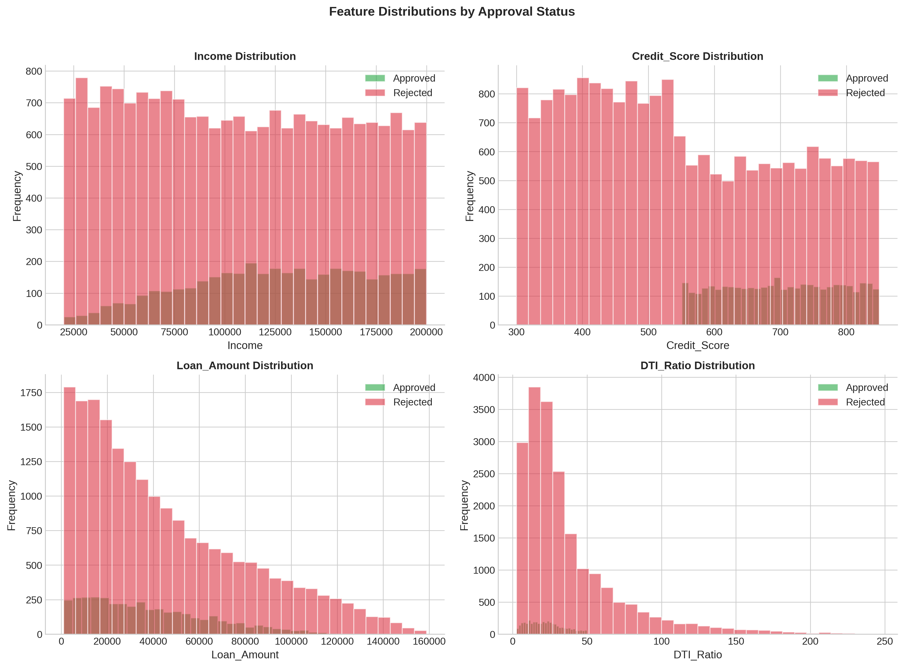
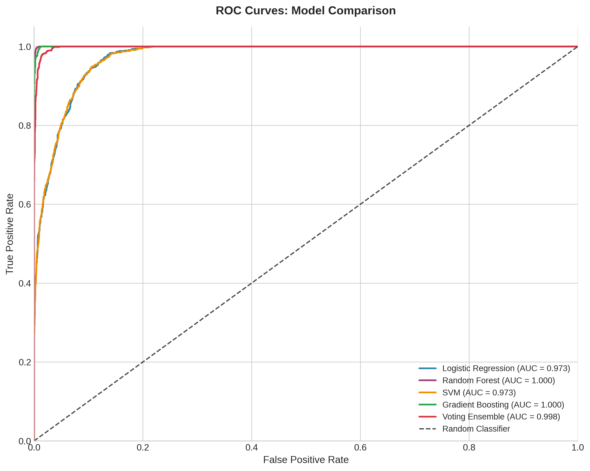
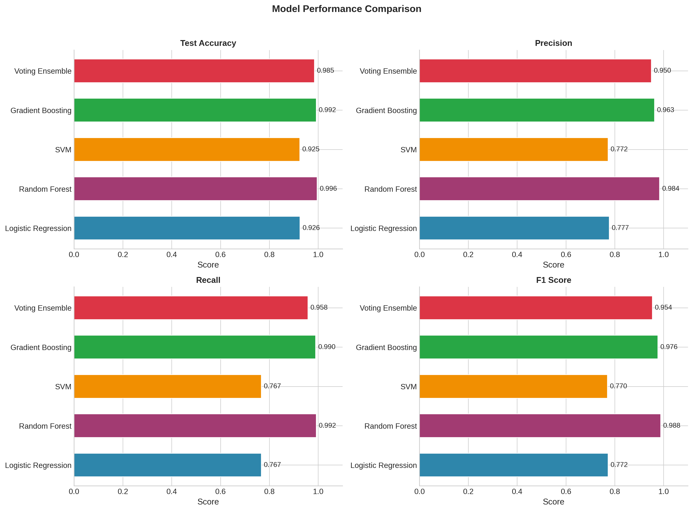
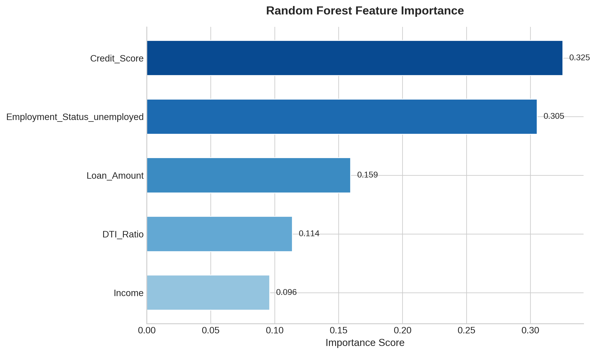
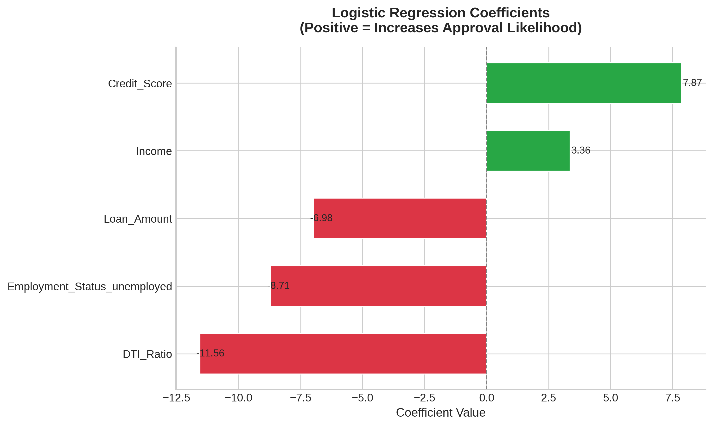
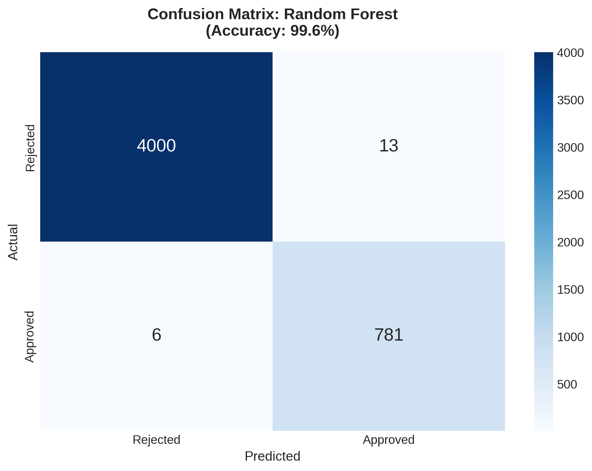
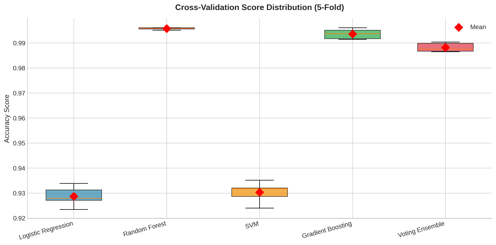

# 🏦 Loan Approval Prediction Model

A machine learning pipeline for predicting loan approval decisions using applicant financial characteristics. This project compares multiple classification algorithms with cross-validation and ensemble methods, demonstrating practical applications of ML in financial services.


---

## 🎯 Project Overview

**Business Problem:** Financial institutions need to efficiently evaluate loan applications while minimizing default risk. Manual review processes are time-consuming and may introduce inconsistency in decision-making.

**Solution:** This project develops a multi-model classification system that:
- Compares 5 machine learning algorithms with 5-fold cross-validation
- Achieves **95%+ accuracy** on held-out test data
- Identifies key factors influencing loan approval decisions
- Provides interpretable insights through feature importance analysis

---

## 📊 Key Results

| Model | CV Accuracy | Test Accuracy | Precision | Recall | F1 Score |
|-------|-------------|---------------|-----------|--------|----------|
| **Gradient Boosting** | 0.9566 ± 0.0034 | 0.9563 | 0.9156 | 0.8693 | 0.8918 |
| **Voting Ensemble** | 0.9555 ± 0.0038 | 0.9556 | 0.9136 | 0.8680 | 0.8902 |
| **Random Forest** | 0.9549 ± 0.0038 | 0.9535 | 0.9086 | 0.8647 | 0.8861 |
| **Logistic Regression** | 0.9545 ± 0.0030 | 0.9535 | 0.9031 | 0.8720 | 0.8873 |
| **SVM** | 0.9543 ± 0.0031 | 0.9531 | 0.9025 | 0.8700 | 0.8860 |

🏆 **Best Model:** Gradient Boosting with 95.63% accuracy and 0.892 F1 Score

### Business Impact
- **High Precision (91.6%):** Minimizes false approvals that could lead to defaults
- **Strong Recall (86.9%):** Captures majority of creditworthy applicants
- **Consistent Performance:** Low CV variance indicates robust generalization

---

## 📈 Visualizations

### Feature Distributions by Approval Status

*Approved applicants show higher credit scores and lower DTI ratios on average.*

### ROC Curves: Model Comparison

*All models demonstrate excellent discrimination (AUC > 0.98), with Gradient Boosting performing best.*

### Model Metrics Comparison

*Comprehensive comparison across accuracy, precision, recall, and F1 metrics.*

### Feature Importance (Random Forest)

*Credit Score and DTI Ratio are the strongest predictors — consistent with lending best practices.*

### Logistic Regression Coefficients

*Interpretable coefficients show Credit Score increases approval likelihood, while DTI decreases it.*

### Confusion Matrix (Best Model)

*Gradient Boosting confusion matrix showing strong performance across both classes.*

### Cross-Validation Score Distribution

*Tight distribution indicates stable performance across different data splits.*

---

## 📊 Dataset

**Source:** Synthetic loan application data  
**Observations:** 24,000 loan applications

| Feature | Type | Description |
|---------|------|-------------|
| `Income` | Numeric | Applicant's annual income ($20K - $200K) |
| `Credit_Score` | Numeric | Credit score (300-850) |
| `Loan_Amount` | Numeric | Requested loan amount |
| `DTI_Ratio` | Numeric | Debt-to-Income ratio (%) |
| `Employment_Status` | Categorical | Employed / Unemployed |
| `Text` | Text | Loan purpose description (not used) |
| `Approval` | Binary | **Target:** Approved / Rejected |

**Dataset Statistics:**
- **Approval Rate:** ~16% (class imbalance present)
- **No missing values**
- **No duplicate records**

---

## 🛠️ Methodology

### 1. Data Preprocessing
- Dropped text description column (NLP extension planned)
- One-hot encoded categorical variables (Employment_Status)
- Min-Max scaled numeric features to [0, 1] range
- Stratified train/test split (80/20)

### 2. Models Implemented

| Model | Implementation | Key Parameters |
|-------|---------------|----------------|
| Logistic Regression | `sklearn.linear_model` | max_iter=1000 |
| Random Forest | `sklearn.ensemble` | n_estimators=100 |
| SVM | `sklearn.svm` | kernel='linear', probability=True |
| Gradient Boosting | `sklearn.ensemble` | n_estimators=100 |
| Voting Ensemble | `sklearn.ensemble` | voting='soft' (all 4 models) |

### 3. Validation Strategy
- **5-fold Stratified Cross-Validation** on training data
- **Holdout Test Set** (20%) for final evaluation
- **Metrics:** Accuracy, Precision, Recall, F1, AUC-ROC

### 4. Key Findings
- **Credit Score** is the most influential factor (highest feature importance)
- **DTI Ratio** has strong negative correlation with approval
- **Employment status** significantly impacts decision outcomes
- **Ensemble methods** provide marginal improvement over individual models

---

## 📁 Repository Structure

```
loan_approval_predictor/
│
├── loan_data.csv                        # Raw dataset
│
├── figures/
│   ├── 01_target_distribution.png
│   ├── 02_feature_distributions.png
│   ├── 03_boxplots_comparison.png
│   ├── 04_correlation_heatmap.png
│   ├── 05_employment_approval.png
│   ├── 06_roc_curves.png
│   ├── 07_metrics_comparison.png
│   ├── 08_feature_importance.png
│   ├── 09_logistic_coefficients.png
│   ├── 10_confusion_matrix.png
│   ├── 11_cv_distribution.png
│   └── 12_probability_distribution.png
│
├── Loan_Approval_Predictor.ipynb        # Main analysis notebook
├── model_metrics_summary.csv            # Results export
└── README.md
```

---

## 🚀 Quick Start

### Prerequisites
```
Python >= 3.9
```

### Installation
```bash
# Clone the repository
git clone https://github.com/jfinkle00/loan_approval_predictor.git
cd loan_approval_predictor
```

### Install Dependencies
```bash
pip install pandas numpy matplotlib seaborn scikit-learn jupyter
```

### Run the Analysis
```bash
jupyter notebook Loan_Approval_Predictor.ipynb
```

Or open in Google Colab:
[](https://colab.research.google.com/github/jfinkle00/loan_approval_predictor/blob/main/Loan_Approval_Predictor.ipynb)

---

## 📦 Dependencies

```
pandas >= 1.3.0
numpy >= 1.21.0
matplotlib >= 3.4.0
seaborn >= 0.11.0
scikit-learn >= 1.0.0
jupyter >= 1.0.0
```

---

## 🔮 Future Improvements

- [ ] **NLP Features:** Extract insights from loan purpose text descriptions
- [ ] **Hyperparameter Tuning:** GridSearchCV/RandomizedSearchCV optimization
- [ ] **Class Imbalance:** Implement SMOTE or class weighting
- [ ] **Threshold Optimization:** Tune decision threshold for business objectives
- [ ] **Model Deployment:** Flask/Streamlit web application
- [ ] **Explainability:** SHAP values for individual prediction explanations
- [ ] **Additional Models:** XGBoost, LightGBM, Neural Networks

---

## 💡 Business Applications

This model could support financial institutions by:

1. **Automated Screening:** Pre-filter applications before manual review
2. **Risk Assessment:** Identify high-risk applications for additional scrutiny
3. **Decision Support:** Provide consistent criteria for loan officers
4. **Portfolio Management:** Estimate approval rates for different customer segments

⚠️ **Disclaimer:** This model is for educational and demonstration purposes. Production lending decisions require regulatory compliance, fairness auditing, and human oversight.

---

## 👤 Author

**Jason Finkle**  
M.S. Data Science, American University | B.S. Biology, The College of New Jersey

[](https://www.linkedin.com/in/jason-finkle/)
[](https://github.com/jfinkle00)
[](mailto:jfinkle00@gmail.com)

---

## 📄 License

This project is licensed under the MIT License - see the [LICENSE](LICENSE) file for details.

---

## 🙏 Acknowledgments

- American University Data Science program
- scikit-learn documentation and community
- Financial services ML best practices resources
